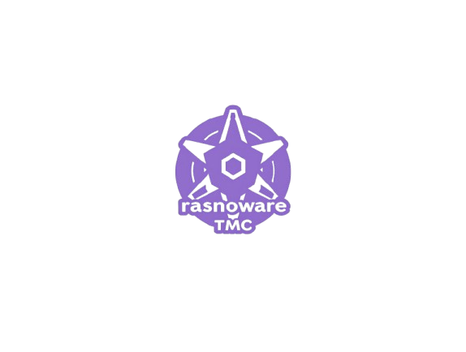

<div align="center">

<sup>Special thanks my followers for supporting me:</sup>

<div>

</div>
<b>
JavaRansomware encrypts a victim’s files through Java, preventing access without a decryption key
The code uses standard Java libraries and a custom encryption routine to execute its malicious payload
</b>
<div>
<sup>Visit <u>warp.dev</u> to learn more.</sup>
</div>

</div>

<hr />

# JavaRansomware

<a href="">[](https://github.com/PanagiotisDrakatos/JavaRansomware/)</a>
<a href=""></a>
<a href=""></a>
<a href=""></a>
<a href=""></a>
<a href=""></a>
<a href=""></a>
<a href=""></a>
<a href=""></a>
<a href=""></a>
<a href="">[](https://github.com/PanagiotisDrakatos/JavaRansomware/pulls)</a>
<a href=""></a>
<a href=""></a>
<a href=""></a>
<a href="">[]()</a>
<a href=""></a>
<a href="">[](https://github.com/PanagiotisDrakatos/JavaRansomware/blob/master/LICENSE)</a>
=======
# What does ransomware do?
<p>There are different types of ransomware. However, all of them will prevent you from using your PC normally, and they will all ask you to do something before you can use your PC.

# JavaRansomware – Educational Ransomware Project in Pure Java

> **Warning**  
> This project is intended **solely for educational and research purposes**.  
> **Do not** use it on any system without explicit permission. Using code like this to compromise systems or data
> without authorization is illegal and unethical.

## Table of Contents

1. [Project Overview](#project-overview)
2. [What does ransomware do?](#what-does-ransomware-do)
3. [Key Features](#key-features)
4. [Technical Details](#technical-details)
    - [Encryption Process](#encryption-process)
    - [Decryption Process](#decryption-process)
    - [Keys and Security](#keys-and-security)
5. [Project Structure](#project-structure)
6 .[Legal Warning](#legal-warning)
6. [Support](#support)
7. [Note](#note)
8. [Contribute](#contribute)
9. [Authors](#authors)
10. [License](#license)

## Project Overview

**JavaRansomware** is a proof-of-concept cryptographic ransomware application written in **pure Java**.
It demonstrates how a malicious actor might encrypt files on a target machine, hold them for
ransom, and only decrypt them upon certain conditions. Ransomware is malware for data kidnapping, an exploit in which
the attacker encrypts the victim's  files and stops them from access them.

As a teaching tool, this repository illustrates common ransomware tactics:

- Iterating through a file system to find and encrypt targeted files.
- Employing **AES-256** as the symmetric cipher.
- Protecting the AES key using **RSA-4096** for additional security.

> **Again**, this software is provided for **educational** and **research** insights into how ransomware threats
> operate, so security professionals, researchers, and students can better understand and defend against them.

---

## What does ransomware do?

There are different types of ransomware. However, all of them will prevent you from using your
PC normally, and they will all ask you to do something before you can use your PC. They can target
any PC users, whether it’s a home computer, endpoints in an enterprise network, or servers
used by a government agency or healthcare provider.

Ransomware can:

* Prevent you from accessing Windows.

* Encrypt files so you can't use them.

* Stop certain apps from running (like your web browser).

Ransomware will demand that you pay money (a “ransom”) to get access to your PC or files. We
have also seen them make you complete surveys. There is no guarantee that paying the fine or
doing what the ransomware tells you will give access to your PC or files again.

## Key Features

1. **Symmetric Encryption (AES-256)**
    - Encrypts files using a robust 256-bit key.
    - Fast and efficient for large volumes of data.

2. **Asymmetric Key Protection (RSA-4096)**
    - The AES key is encrypted with a 4096-bit RSA public key.
    - Prevents easy key recovery without the matching RSA private key.

3. **Configurable File Paths**
    - Specify which folders or directories to target for encryption/decryption.

4. **Simple Command-Line Interface**
    - Takes arguments for path and action (encrypt or decrypt).

5. **Educational-Focused**
    - The code is structured to highlight each step of the ransomware life cycle.
    - Clear class and method names to guide understanding.

### Encryption Process

1. **File Discovery**
    - The ransomware scans a specified directory (recursively) for files to encrypt.

2. **AES Key Generation**
    - Generates a random 256-bit (32-byte) AES key.
    - This key protects the actual file contents.

3. **RSA Public Key Encryption**
    - The generated AES key is itself encrypted with an RSA-4096 public key.
    - This ensures that only someone with the corresponding private key can decrypt and recover the AES key.

4. **AES File Encryption**
    - Each targeted file is encrypted with the AES key in **CBC** or **ECB** mode (depending on the implementation in
      the code).
    - Encrypted data replaces the original file contents (or is written to a new file).

5. **(Optional) Logging/DB**
    - The project references an embedded database for storing the victim ID, key references, etc.
    - In a real scenario, this might be replaced by an online Command & Control (C2) server.

### Decryption Process

1. **RSA Private Key**
    - The private key (matching the earlier RSA public key) decrypts the stored AES key.

2. **AES File Decryption**
    - The now-recovered AES key is used to decrypt the files, restoring them to their original contents.

### Keys and Security

- **AES-256** is a symmetric cipher considered secure under modern standards.
- **RSA-4096** ensures the key exchange is non-trivial to brute force.
- Combined, these create a typical hybrid encryption model used by many real-world ransomware variants.

## Technical Details

This project aims to build an almost functional crypto-ransomware for educational purposes, written in in pure java.
Basically, it will encrypt your files in background using AES-256, a strong encryption algorithm, using RSA-4096 Public
Key to secure the AES Symetric key and store it in an embeeded database.

Assume that there is a C&C Server who for store the Id and the respective encryption key and possibly act as a Command
and Control server in the near future.

For Education Purposes I will not Provide the Full Server source code.,as i decribed in the previous paragraph. Let's
imagine a simple testing example which client by deafult has the Asymmetrtic encryption keys.

The easiest way to run this Project is to use the
<a href="https://github.com/PanagiotisDrakatos/JavaRansomware/blob/master/JavaRansomware-2.1-jar-with-dependencies.jar">
.jar</a> open a cmd terminal and simply run the below commands
=======

 ```
 $ mvn clean install
```

Encrypt all files in the current Path wait until the execution will be finished

=======
<p> Encrypt All Files in the Current Path wait until the execution will be finished </p>

 ```
 $ java -jar JavaRansomware.jar C:\Users Encrypt
```

<p> Decrypt All Files in the Current Path wait until the execution will be finished </p>

 ```
 $ java -jar ...JavaRansomware\targetJavaRansomware.jar
```

> DON'T RUN JavaRansomware.jar IN YOUR PERSONAL MACHINE, EXECUTE ONLY IN A TEST ENVIRONMENT(VMWARE)!

if you want to use the project programmatically just put the below code in your project and simply run it. Don't forget
to give Input arguments from the Command-Line Arguments. i've put a printscreen to see how to give Paramaters

<h2>Java Manual</h2>

```java
package com.security;


import java.nio.file.Path;
import java.nio.file.Paths;
import java.security.GeneralSecurityException;

public class Example {
    private static final String PubicKey = "MFwwDQYJKoZIhvcNAQEBBQADSwAwSAJBAJCw1HHQooCFGsGhtxNrsdS6dDq5jtfHqqLInCj7qFlDaD/Sll5+BAUjV0GU/c+6PVyMKzmLrHh49eeGQy1ETN8CAwEAAQ==";
    private static final String PrivateKey = "MIIBVAIBADANBgkqhkiG9w0BAQEFAASCAT4wggE6AgEAAkEAkLDUcdCigIUawaG3E2ux1Lp0OrmO18eqosicKPuoWUNoP9KWXn4EBSNXQZT9z7o9XIwrOYuseHj154ZDLURM3wIDAQABAkA9AnLx8tkye+2GTBwYEkcPvfcYc/mpPsXSkehW15Zq3IALx3Kr5GgKGOaB2FK6PU0QzEPQbNJXdA5ZPjwTDcQBAiEA1/zINRVlrLpw2HPfqsYQ8ZSDuG2rVUUKKmKgJQXeQ98CIQCrfsw2+VKOaFoJm5BpVxIT5nsE8CXn4fr/WSFuklMXAQIgTKWnAreCKmbLTvTn5bl+H8zdZaB9kbf7YIk5XYoUky8CIQCL2ccnPYK5ZxelphrKDJtNZzMC/+OpiXtqKIE+7kycAQIgRK/DUhWUgSQV5u7VoCHDyLPCntjFMGBsg7Wi1uq+EDM=";


    public static void main(String[] args) throws RansomwareException, GeneralSecurityException {
        // Set Whatever path you want to test
        Path testPath = Paths.get("C:\\Users\\User\\Documents\\GitHub\\JavaRansomware\\src\\resources");
        //Path testPath = Paths.get(Objects.requireNonNull(ExampleTest.class.getResource("/test.txt")).toURI());
        PipelineData pipelineData = new PipelineData();
        pipelineData.setPrivateKey(PrivateKey);
        pipelineData.setPublicKey(PubicKey);

        // Alternative Gen RSA. Make sure you save the keypair to a file if not loaded
//        RSAGenKeyReader.StringKeyPair keyPair=RSAGenKeyReader.generateKeyPair();
//        pipelineData.setPrivateKey(keyPair.privateKey());
//        pipelineData.setPublicKey(keyPair.publicKey());

        pipelineData.setRootPath(testPath.toAbsolutePath().toString());

        Pipeline<PipelineData, PipelineData> encrypt_filters = new Pipeline<PipelineData, PipelineData>(new DatabaseRetrieveHandler())
                .addHandler(new GenSymmetricKeyHandler())
                .addHandler(new RansomwareEncryptHandler())
                .addHandler(new EncryptKeyHandler())
                .addHandler(new DatabaseStoreHandler());
        var encrypt_output = encrypt_filters.execute(pipelineData);
        System.out.println("Pipeline encrypt_output: " + encrypt_output);


        Pipeline<PipelineData, PipelineData> decrypt_filters = new Pipeline<PipelineData, PipelineData>(new DatabaseRetrieveHandler())
                .addHandler(new DecryptKeyHandler())
                .addHandler(new RansomwareDecryptHandler())
                .addHandler(new DecryptKeyHandler());
        var decrypt_output = decrypt_filters.execute(pipelineData);
        System.out.println("Pipeline output: " + decrypt_output);
    }
}

```

---


## Legal Warning
While this may be helpful for some, there are significant risks. JavaRansomware may be used only for 
Educational Purposes. Do not use it as a ransomware! You could go to jail if if you will use it for 
malicious purposes.<


## Support

For support, email panagiotisdrakatos@gmail.com or join me Discord:panos5427.
Meaning, if you liked using this app or it has helped you in any way,
I'd like you send me an email about anything you'd want to say about this software.
I'd really appreciate it!

## Note

- ⭐️ Give me a Star!! JavaRansomware is constantly updating, support us!
- The analysis was done by me, without having obfuscated the source code (either with pyarmor etc),
- I would not recommend using JavaRansomware + obfuscatebecause many times av trigger obfuscated codes as false positive
  even if legitimate.

## Contribute

1. Fork it: git clone https://github.com/PanagiotisDrakatos/JavaRansomware.git
2. Create your feature branch: git checkout -b my-new-feature
3. Commit your changes: git commit -am 'Add some feature'
4. Push to the branch: git push origin my-new-feature
5. Submit a pull request :D

## Authors

- [@panagiotisdrakatos](https://github.com/PanagiotisDrakatos)

## License

This project is distributed under the MIT license version 2.0 (see the LICENSE file in the project root).

By submitting a pull request to this project, you agree to license your contribution under the MIT license version 2.0
to this project.

[](https://choosealicense.com/licenses/mit/)
=======
# Contribute
 1. Fork it: git clone https://github.com/PanagiotisDrakatos/JavaRansomware.git
 2. Create your feature branch: git checkout -b my-new-feature
 3. Commit your changes: git commit -am 'Add some feature'
 4. Push to the branch: git push origin my-new-feature
 5. Submit a pull request :D
 
# License
This project is distributed under the MIT license version 2.0 (see the LICENSE file in the project root).

By submitting a pull request to this project, you agree to license your contribution under the MIT license version 2.0
to this project.

[](https://choosealicense.com/licenses/mit/)
